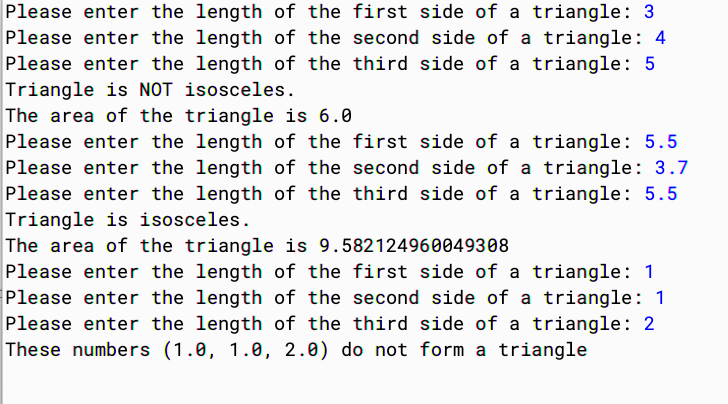

# Homework 1, Part A: Area of a Triangle


## Goals:

Practice with:
* working with BlueJ IDE to write, compile, run simple java programs
* java primitive data types, expressions and operators
* defining and calling methods
* selecting testing values


## Description

Write a program, `AreaTriangle`, that prompts the user three times for the side lengths of a triangle. Based on these three inputs, the program checks and prints whether this triangle is isosceles or not, as well as its area. In addition to the `main()` method, **your program should also define three
other static methods**:
  1. a predicate method `isValidTriangle()` to check whether the three inputs define a triangle, based on the **triangular inequality** (that is, the sum of any two sides of a triangle is strictly greater than the third side),
  2. a method to `getHeronArea()` compute the triangle's area based on [Heron's Formula](http://en.wikipedia.org/wiki/Heron%27s_formula) given the three side lengths,
  3. a predicate method `isIsosceles()`  to check whether the triangle is isosceles

Some important notes on this exercise:

* Equilateral triangles are considered isosceles.
* If the user enters three side lengths that cannot possibly form a triangle (ex. 1,1,2), your program should say that this set of input does not form a triangle and stop execution. 
* You do not need to handle the case when the user enters other invalid input, e.g. negative number(s) or non-numbers.

<!--
Some sample executions of this program are shown below:

<center></center>
-->


## Starter Code

Please use the starter code below:

`AreaTriangle.java`:
```java
// Import the necessary library (Scanner), to read user-inputted text
import java.util.Scanner;

public class AreaTriangle
{
    public static boolean isValidTriangle(double a, double b, double c) {
        return false; // TODO replace this with your implementation
    }
    
    public static boolean isIsosceles(double a, double b, double c) {
        return false; // TODO replace this with your implementation
    }
    
    public static double getHeronArea(double a, double b, double c) {
        return 0.0; // TODO replace this with your implementation
    }
    
    public static void main(String[] args) {
        // Create a "scanner," used to read user-inputted text
        Scanner scanner = new Scanner(System.in);

	// Read in a user-inputted double from the text prompt
        System.out.print("Please enter first side: ");
        double a = scanner.nextDouble();

        System.out.print("Please enter second side: ");
        double b = scanner.nextDouble();

        System.out.print("Please enter third side: ");
        double c = scanner.nextDouble();

        if (!isValidTriangle(a, b, c)) {
            System.out.println("This is not a valid triangle.");
            return;
        }
        
        if (isIsosceles(a, b, c)) {
            System.out.println("The triangle is isosceles.");
        } else {
            System.out.println("The triangle is NOT isosceles.");
        }
        
        System.out.println(
            "The area of the triangle is: " + getHeronArea(a, b, c)
        );
    }
}
```


## Testing your program

Think carefully about the set of inputs (testing cases) you will provide to your program to assert its correctness. Your inputs should be such that every method you wrote is tested (invoked) as your program runs.

To show work for your testing, please run the program with many different inputs that trigger every execution path. For each run, save the results of your testing produced in the "BlueJ: Terminal Window" into a `.txt` file (Options > Save to File...). Finally, compose a file called `AreaTriangleTest.txt` containing the outputs of each of your test runs.


## What to submit

It is a standard policy of this course that submissions that have not been signed (`@author`) and dated (`@version`) will not be graded.


Your Gradescope submission should contain the following:

1. your <code>AreaTriangle.java</code> file
2. your <code>AreaTriangleTest.txt</code> file that contains your testing results


<br/>

# Homework 1, Part B: Fun with Loops

## Goals:
Practice with:
* working with BlueJ IDE to write, compile, run simple java programs
* java primitive data types, expressions and operators
* reading from the standard input (Scanner)
* practicing loops
* selecting testing values


## Description
In this exercise, you will learn how to use different types of loops in your code, based on the needs of that program. You are given the starter code below, and your goal is to fill in the body of the empty methods with logic based on the descriptions provided here.


`FunLoops.java`:
```java
import java.util.Scanner;

/**
 * Write a description of class FunLoops here.
 *
 * @author (write your name here)
 * @version (write a version number or a date here)
 */

public class FunLoops{

  /**
  * Part 1 of the exercise.
  * This method should act like a parrot, printing the string 's' n times.
  */
  public static void parrot(String s, int n){
    
  }

  /**
  * Part 2 of the exercise.
  * This method should act like a toddler who knows their numbers, once they 
  * are given a number, they start reciting all numbers from 1 to that number.
  * Only one number should be printed per line.
  * @param theNum the input number
  */
  public static void toddler(int theNum){

  }

  /**
  * Part 3 of the exercise.
  * This method should act like a dreamer, who draws a triangle of stars once 
  * they are given a number.
  * @param theNum the input number
  */
  public static void dreamer(int theNum){

  }

  public static void main(String[] args){
    parrot("CS230", 10);
    
    System.out.println("\nNow calling toddler(6)");
    toddler(6);
    
    System.out.println("\nNow calling dreamer(4)");
    dreamer(4);
  }
}
```

**Part1: The parrot.**
Complete the method `parrot()` in the starter code provided for you. This method takes in a string and an integer `n`, printing out the string `n` times.

**Part2: The toddler.**
Complete the method `toddler()` in the starter code provided for you. This method will be given a number as parameter and it will list out all numbers from 1 to that number. The method should print out each number on their own line.

**Part3: The dreamer.**
Complete the method `dreamer()` in the starter code provided for you. This method will be given a number as parameter and then it will draw a right-angled triangle of stars. The height and base of that triangle will consist of a number of stars equal to the input number.

Please note:
* We recommend you start by writing on a piece of paper how the three methods should work. You need to know what your correct answer should look like before you program!
* You can assume that the user will enter valid input, in the form of integer numbers. You don't need to handle invalid inputs.
* The sample `main()` we have provided is not complete, in the sense that it does not show all the calls to the methods. To test them you should call each one multiple times. 
* You should test each method you implemented above separately. They should not depend on each other.
* Some methods can be implemented using more than one type of loop. We will accept all correct answers, as long as the code is not overly complicated.


## Testing your program

Think carefully about the set of inputs (testing cases) you will provide to your program to assert its correctness. Your inputs should be such that every method you wrote is tested (invoked) as your program runs.

In BlueJ, save the results of your testing produced in the "BlueJ: Terminal Window" into a file called loopsTest.txt. (Options > Save to File...)

## What to submit

It is a standard policy of this course that submissions that have not been signed (`@author`) and dated (`@version`) will not be graded.

Your Gradescope submission should contain the following:

1. your <code>FunLoops.java</code> source file
2. your <code>loopsTest.txt</code> text file that contains your testing results


