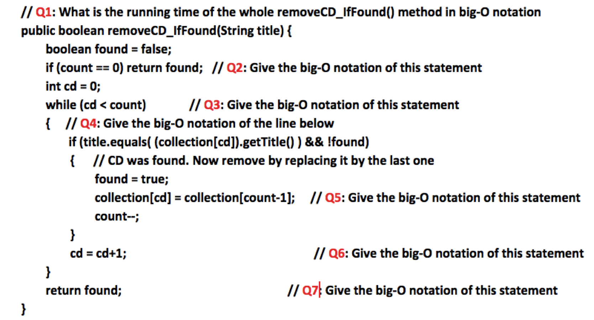

# Homework 7, Part A: Merge Sorting a Linked List


## Task 0: Creating your BlueJ project

Create a BlueJ project with the following starter code.

`LinearList.java`:
```java
public interface LinearList<T> {
    public boolean isEmpty();
    public int size();
    public T get(int position);
    public void insert(int position, T element);
    public T remove(int position);
    public T[] toArray();
    public String toString();
}
```

`LinearNode.java`:
```java
public class LinearNode<T> {
   private LinearNode<T> next;
   private T element;

   public LinearNode() {
      next = null;
      element = null;
   }

   public LinearNode(T elem) {
      next = null;
      element = elem;
   }

   public LinearNode<T> getNext() {
      return next;
   }

   public void setNext(LinearNode<T> node) {
      next = node;
   }

   public T getElement() {
      return element;
   }

   public void setElement(T elem) {
      element = elem;
   }
}
```

`LinkedList.java`:
```java
public class LinkedList<T> implements LinearList<T> {
    protected LinearNode<T> front;
    protected int count;
    
    public LinkedList() {
        this.front = null;
        this.count = 0;
    }
    
    public boolean isEmpty() {
        return this.count == 0;
    }
    
    public int size() {
        return this.count;
    }

    protected LinearNode<T> getNode(int position) {
        if (position < 0 || position >= this.count) {
            throw new RuntimeException(
                "Asking for element at index " + position 
                + " in a list of size" + this.count
            );
        }
        
        LinearNode<T> current = this.front;
        for (int i = 0; i < position; i++) {
            current = current.getNext();
        }
        
        return current;
    }
    
    public T get(int position) {
        LinearNode<T> node = this.getNode(position);
        if (node == null) {
            return null;
        }
        
        return node.getElement();
    }
    
    public void insert(int position, T element) {
        LinearNode<T> node = new LinearNode<T>(element);
        
        if (position == 0) {
            node.setNext(front);
            front = node;
        } else {
            LinearNode<T> before = this.getNode(position - 1);
            node.setNext(before.getNext());
            before.setNext(node);
        }
        
        this.count++;
    }
    
    public T remove(int position) {
        LinearNode<T> current;
        if (position == 0) {
            current = front;
            front = front.getNext();
        } else {
            LinearNode<T> before = this.getNode(position - 1);
            current = before.getNext();
            before.setNext(current.getNext());
        }  
        
        this.count--;
        return current.getElement();
    }

    public T[] toArray() {
        T[] array = (T[]) (new Object[this.count]);
        
        LinearNode<T> current = this.front;
        for (int i = 0; i < this.size(); i++) {
            array[i] = current.getElement();
            current = current.getNext();
        }
        
        return array;
    }
    
    public String toString() {
        String s = "[ ";
        
        LinearNode<T> current = this.front;
        for (int i = 0; i < this.size(); i++) {
            s += current.getElement().toString() + ", ";
            current = current.getNext();
        }
        
        return s + "]";
    }
}
```


<br/>

# Submission Checklist

* You submitted **all** `.java` files and all `.txt` files.
* Your files are named **exactly** as in the homework specification, *including file extensions*.
* You tested **every possible** pathway in your code.
* You signed every class (or file) with `@author` and `@version`, accompanied by a description of what the class does.
* You wrote javadoc for every function, which includes `@param` and `@return`.
* You wrote inline comments explaining the logic of your code.


<!--

# Homework 7, Part A: Big-O

## Learning Goals

* Understanding the Big-O complexity at the level of individual statements and methods


## Task: Find the running time of statements in a method

Consider the following method that removes a CD from a linear collection (e.g. array).





Assume that the collection has `n` CDs to start with. Answer each of the questions below. Provide your answer by writing a sentence for each question, and then explaining the Big-O notation associated with the relevant statement.

**Note:** If you find any of the Questions ambiguous (that is, it may mean two different things and you are not sure which one is the correct interpretation), explain why and give your answer **for each alternative**.

Write your answer in a text file called `BigO.txt` (not a Word `.doc` or some other special format---just plain text) and submit it in the proper assignment folder.


<br/>

# Homework 7, Part B: Trace Sorting by hand


## Learning Goals
* Gain a detailed understanding on how sorting algorithms work
* Working with best-known sorting algorithms

## Exercise: Trace Sorting Algorithms

Complete the following questions on paper by hand, scan them as a PDF, and submit as the file `SortingTrace.pdf` to Gradescope.

Given the following array of numbers:

`255 31 15 127 511 1023 63 7 2047`

Show a trace of execution for each of the sorting methods as shown in the book:

1. selection sort (listing 13.5, page 492)
2. insertion sort (listing 13.5, page 493)
3. merge sort (listing 13.5, page 495)

The meaning of **"trace"** depends on each sorting method.

* For selection sort, it means to display the contents of the array at every selection.
* For insertion sort, it means to display the contents of the array after each insertion.
* For mergesort, it means to draw the two trees that are created by splitting and merging.


## What to submit
* Make sure you title your paper and you write your name(s) on the document you are submitting.
* Create a PDF file named `SortingTrace.pdf` by scanning the completed worksheet and submit to Gradescope.


<br/>

# Submission Checklist

* You submitted **all** `.pdf` files and all `.txt` files.
* Your files are named **exactly** as in the homework specification, *including file extensions*.

-->