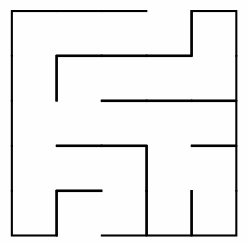

# Homework 9

## Learning Goals

* Use java's Vector and LinkedList classes
* Implement a graph traversal
* Implement the DiGraph (Directed Graph) interface

## Pair Programming

We will assign you a peer to collaborate with on this assignment. Please,
* Reach out to your partner ASAP to discuss when you will meet to work on the assignment. You will probably have to meet several times.
* Work *together* (pair programming) rather than *divide and conquer*.
* *Discuss* the ideas and diagrams before diving into coding.

## Task 1: Complete the Directed Graph Implementation

Download [this starter code](https://drive.google.com/drive/folders/1krBZDDD2eIpduktsZLZI0CSJg6V60E5w?usp=sharing). It contains the solutions from last week's lab. Feel free to use your version, if you feel more comfortable with that one.

Complete the implementation of the DiGraph interface. Take it one method at a time, make sure to include appropriate javadoc, and test as you go. For the methods where you don’t immediately come up with a solution, write the pseudocode before writing the code for the method. Remember, arriving at a solution quickly that hasn’t been thought through and has mistakes will probably take longer to debug than thinking carefully - and slowly - of a solution that works for all cases you can think of.

## Task 2: Graph Traversal

Together with your partner, take a look at the pseudocode for the depth-first search traversal seen in class. Now write code to implement it. Make sure to test it on a few different kinds of graphs/paths to make sure it works as expected. 

## Task 3: Graph Driver

Now you’re ready to test your implementation, before sending the graph off to your friends to play with.

Create a new driver program, `Driver.java`, and think carefully about where it should be placed in your project. Test each method thoroughly on all possible paths, marking clearly what result you expect and what you obtained. Store the outputs of your tests in `Tests.txt`.

 

# Submission Checklist

* You submitted **all** `.java` files and all `.txt` files.
* Your files are named **exactly** as in the homework specification, *including file extensions*.
* You tested **every possible** pathway in your code.
* You signed every class (or file) with `@author` and `@version`, accompanied by a description of what the class does.
* You wrote javadoc for every function, which includes `@param` and `@return`.
* You wrote inline comments explaining the logic of your code.

<!--
# Homework 9, Part A: Graphs

## Learning Goals

* To understand Graphs and alternative implementations
* To understand and practice  basic graph traversal algorithms

**Note:** This exercise involves NO programming.

## Exercise: Working with Graphs

In this task you will work with an undirected Graph `G = {V, E}`, where `V = {f,p,s,b,l,j,t,c,d}` and `E = {(1,2), (1,3), (3,8), (4,8), (8,9), (1,7), (2,6), (2,3), (5,6), (6,7), (7,9), (8,1)}`.

Assume that the nodes are stored in an indexed linear structure (e.g., an array or a vector) numbered consecutively from 1 (node `f`) to 9 (node `d`).

### Task 1
Represent the graph `G` using the adjacency matrix representation. Draw this representation in your notebook or on your computer (using a drawing application).

### Task 2
Represent the graph `G` using the adjacency lists representation. Draw this representation in your notebook or on your computer (using a drawing application).

### Task 3
Type up a `tgf` representation of the graph `G` manually in a file, named `G.tgf`. Open that file in yEd and see the produced visualization of the graph. Arrange the nodes, on the yEd window, nicely so that the edges are not crossing. Try the various Layout options, including Orthogonal. Take a snapshot of that image.

### Task 4
Find a path from node `l` to node `b` with length 8, that passes through every vertex of the graph.
List the nodes of that path.

### Task 5
The graph `G` contains cycles. What is the smallest number of vertices to remove in order to break all cycles?

### Task 6
Run, by hand, a depth-first search (DFS) traversal of the graph `G`, starting at node  `p`. When choosing which node to visit next amongst the possibilities, choose the one that is next in alphabetical order. Give your answer by listing the edges in the order that DFS will select.

## Submitting your work

Submit one PDF file, named `GraphOnPaper.pdf` that contains your answers to all 6 questions, clearly marked: "Task 1 Answer" to "Task 6 Answer". Make sure the document you submit contains your name.

 

# Homework 9, Part B: Maze

## Learning Goals

* To understand the correspondence between Graphs and Mazes
* To understand how a graph algorithm can solve a maze problem

**Note:** This exercise involves NO programming.

## Exercise: Solving a maze

Consider the following maze:

Think about how you would model this maze as a graph so that you can employ graph traversal algorithms in order to solve it. By solving a maze we mean to have an algorithm that, entering from the top opening of the maze will exit at the bottom opening.

Some questions to consider:
1. How do you decide what is a vertex?
2. How do you decide what is an edge or an arc?
3. Show the data structure that represents the graph defined by the vertices and edges/arcs you chose.
4. Show the DFS and BFS traversals of the graph defined by your data structure
5. Which traversal is better? How did you decide?

## Submitting your work

Write up your answer on paper and take a photo of it. Submit one PDF file, named `MazeOnPaper.pdf` that contains your answers to all questions, clearly marked: "Task 1 Answer" to "Task 2 Answer", etc.

Make sure the document you submit contains your name.

-->

